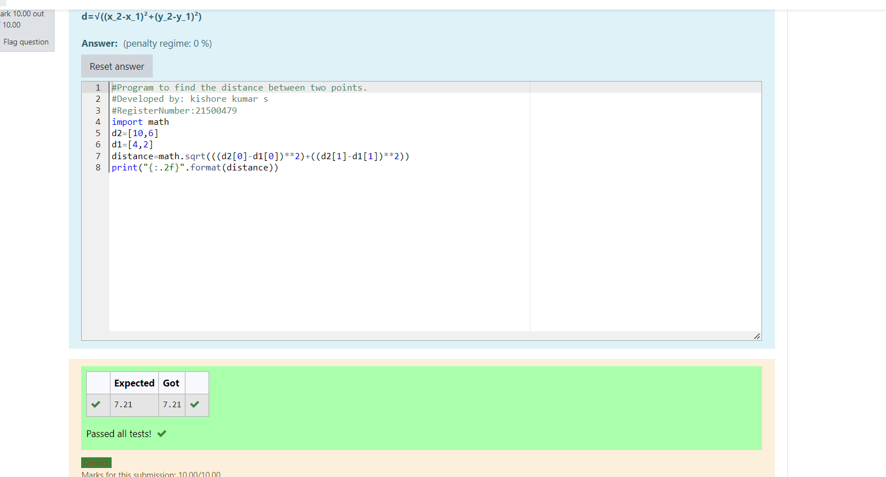

# DISTANCE-BETWEEN-TWO-POINTS

## AIM:
To write a python program to find the distance two 2 points
## ALGORITHM:
### Step 1:
import numpy
### Step 2: 
get the input
### Step 3: 
Substitute the values in the distance formula  
### Step 4: 
print the output
### Step 5: 
End the program
### PROGRAM:
```
#Program to find the distance between two points.
#Developed by: kishore kumar s
#RegisterNumber:21500479
import math
d2=[10,6]
d1=[4,2]
distance=math.sqrt(((d2[0]-d1[0])**2)+((d2[1]-d1[1])**2))
print("{:.2f}".format(distance))
```
  


### OUTPUT:


### RESULT:

Thus a python program to find the distance two 2 points is sucessfully executed